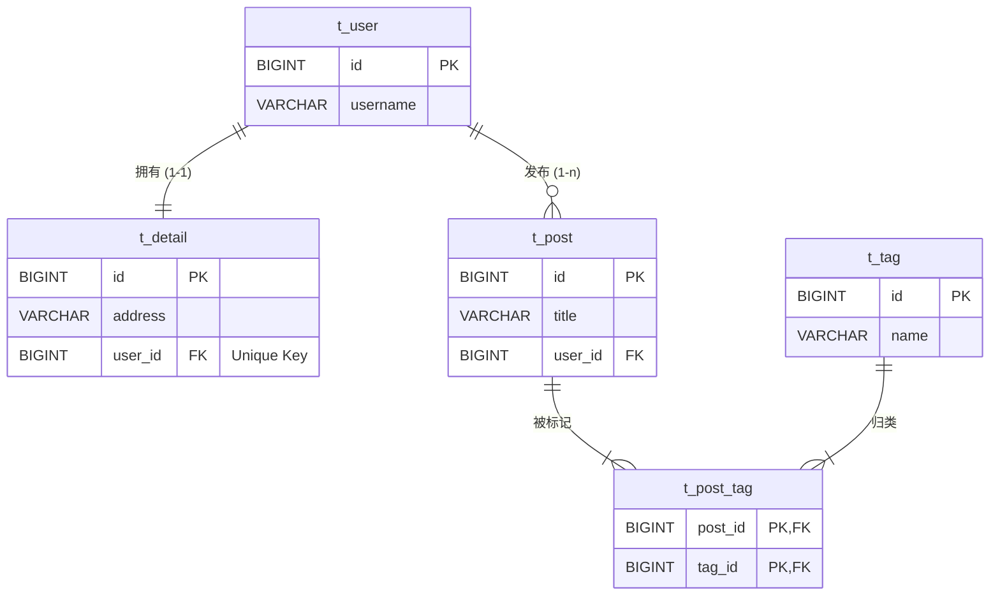

# Spring Boot JPA 关联关系演示

2025.11.29

本文将说明数据库中表的三种关联模式(1-1, 1-n, n-m)并通过一个非常简单的 Spring Boot 项目来展示它在 JPA 中的体现。

我们将设计一个博客系统的简化模型：

- 1-1 (One-to-One): 用户 (`User`) 和 用户详情 (`Detail`)。一个用户只能有一个详情页。
- 1-n (One-to-Many): 用户 (`User`) 和 文章 (`Post`)。一个用户可以写多篇文章。
- n-m (Many-to-Many): 文章 (`Post`) 和 标签 (`Tag`)。一篇文章有多个标签，一个标签也可以属于多篇文章。



## 1. 准备数据库(MySQL)

SQL 内容([下载](init_db.sql))如下，可以通过 MySQL 客户端执行，我用的是 Workbench. 

```sql
-- 创建数据库
CREATE DATABASE IF NOT EXISTS jpa_demo CHARACTER SET utf8mb4 COLLATE utf8mb4_unicode_ci;
USE jpa_demo;

-- 创建表和外键约束
-- 1. 用户表
CREATE TABLE t_user (
    id BIGINT AUTO_INCREMENT PRIMARY KEY,
    username VARCHAR(50) NOT NULL
);

-- 2. 用户详情表 (1-1 关系)
-- user_id 是外键，且必须加上 UNIQUE 约束，才能保证物理层面是一对一
CREATE TABLE t_detail (
    id BIGINT AUTO_INCREMENT PRIMARY KEY,
    address VARCHAR(255),
    user_id BIGINT UNIQUE, 
    CONSTRAINT fk_detail_user FOREIGN KEY (user_id) REFERENCES t_user(id)
);

-- 3. 文章表 (1-n 关系)
-- user_id 是外键，一个用户对应多行数据
CREATE TABLE t_post (
    id BIGINT AUTO_INCREMENT PRIMARY KEY,
    title VARCHAR(100),
    user_id BIGINT,
    CONSTRAINT fk_post_user FOREIGN KEY (user_id) REFERENCES t_user(id)
);

-- 4. 标签表
CREATE TABLE t_tag (
    id BIGINT AUTO_INCREMENT PRIMARY KEY,
    name VARCHAR(50)
);

-- 5. 文章-标签中间表 (n-m 关系)
-- 需要两个外键，分别指向 Post 和 Tag
CREATE TABLE t_post_tag (
    post_id BIGINT,
    tag_id BIGINT,
    PRIMARY KEY (post_id, tag_id),
    CONSTRAINT fk_pt_post FOREIGN KEY (post_id) REFERENCES t_post(id),
    CONSTRAINT fk_pt_tag FOREIGN KEY (tag_id) REFERENCES t_tag(id)
);
```

## 2. Spring Boot Project

### 2.1 创建工程

这里我通过 [Spring Initializr](https://start.spring.io/) 创建，依赖项选择了：

- MySQL Driver
- Spring Data JPA


点击 GENERATE 下载，解压后用 IntelliJ IDEA 打开项目目录。

### 2.2 项目配置

在 `src/main/resources/application.properties` 中配置数据库连接。

```plaintext
# 数据库连接
spring.datasource.url=jdbc:mysql://localhost:3306/jpa_demo?useSSL=false&serverTimezone=UTC&characterEncoding=utf8
spring.datasource.username=demo
spring.datasource.password=123abc
spring.datasource.driver-class-name=com.mysql.cj.jdbc.Driver

# JPA 配置
# validate: 启动时验证 Entity 是否与数据库表结构一致（生产环境常用）
# update: 如果不一致会自动修改表结构（开发环境常用，这里为了演示设为 update 以防字段微调）
spring.jpa.hibernate.ddl-auto=update
spring.jpa.show-sql=true
spring.jpa.properties.hibernate.format_sql=true
```

### 2.3 定义 JPA 实体(Entity)

这里是最核心的部分，我们需要将 Java 类映射到刚才创建的表，并且要正确反映表之间的关联关系。参考代码实现：

**User**

这个类中定义了如下关联：

```java
    // === 1-1 关系: User <-> Detail ===
    // mappedBy = "user" 表示关系的维护端在 Detail 类中的 user 属性
    // CascadeType.ALL 表示保存 User 时自动保存 Detail
    @OneToOne(mappedBy = "user", cascade = CascadeType.ALL)
    private Detail detail;

    // === 1-n 关系: User <-> Post ===
    // mappedBy = "user" 表示外键在 Post 表侧
    @OneToMany(mappedBy = "user", cascade = CascadeType.ALL)
    private List<Post> posts;
```

完整代码参[io.github.iridiumcao.jpademo.entity.User](src/main/java/io/github/iridiumcao/jpademo/entity/User.java)

**Detail**

这个类中定义了如下关联：

```java
    // === 1-1 关系配置 ===
    @OneToOne
    // 指定数据库中的外键列名，unique = true 强调物理上的 1-1
    @JoinColumn(name = "user_id", unique = true)
    private User user;
```

完整代码参 [io.github.iridiumcao.jpademo.entity.Detail](src/main/java/io/github/iridiumcao/jpademo/entity/Detail.java)

**Post**

这个类中定义了如下关联：

```java
    // === n-1 关系: Post -> User ===
    @ManyToOne
    @JoinColumn(name = "user_id") // 指定外键列
    private User user;

    // === n-m 关系: Post <-> Tag ===
    // 使用 @JoinTable 描述中间表
    @ManyToMany(cascade = CascadeType.PERSIST) // 通常 n-m 不用 ALL，避免删文章把标签也删了
    @JoinTable(
            name = "t_post_tag", // 中间表名
            joinColumns = @JoinColumn(name = "post_id"), // 当前对象在中间表的外键
            inverseJoinColumns = @JoinColumn(name = "tag_id") // 对方对象在中间表的外键
    )
    private List<Tag> tags = new ArrayList<>();
```
完整代码参[io.github.iridiumcao.jpademo.entity.Post](src/main/java/io/github/iridiumcao/jpademo/entity/Post.java)

**Tag**

这个类中定义了如下关联：

```java
    // === n-m 关系: Tag <-> Post ===
    // mappedBy 表示由 Post 类的 tags 属性维护关系
    @ManyToMany(mappedBy = "tags")
    private List<Post> posts;
```
完整代码参 [io.github.iridiumcao.jpademo.entity.Tag](src/main/java/io/github/iridiumcao/jpademo/entity/Tag.java)

### 2.4 编译运行项目

项目仓库：<git@github.com:iridiumcao/spring-boot-jpa-relationships-demo.git>

编译运行项目的指令如下：

```bash
mvn clean compile
mvn spring-boot:run
```

我们可以在日志中看到如下输出：

```plaintext
====== 开始 JPA 关联测试 ======
Hibernate: 
    insert 
    into
        t_user
        (username) 
    values
        (?)
Hibernate: 
    insert 
    into
        t_detail
        (address, user_id) 
    values
        (?, ?)
>>> 用户及详情已保存，User ID: 3
Hibernate: 
    insert 
    into
        t_post
        (title, user_id) 
    values
        (?, ?)
Hibernate: 
    insert 
    into
        t_post
        (title, user_id) 
    values
        (?, ?)
>>> 两篇文章已保存
Hibernate: 
    insert 
    into
        t_tag
        (name) 
    values
        (?)
Hibernate: 
    insert 
    into
        t_tag
        (name) 
    values
        (?)
>>> 标签关联已建立

====== 查询验证 ======
1. [1-1] 用户名: JohnDoe
   用户地址: 123 Baker Street
2. [1-n] 该用户发布的文章数量: 2
   - 文章标题: Hibernate Tips
     [n-m] 包含标签: Java Database 
   - 文章标题: Spring Boot Guide
     [n-m] 包含标签: Java 
Hibernate: 
    insert 
    into
        t_post_tag
        (post_id, tag_id) 
    values
        (?, ?)
Hibernate: 
    insert 
    into
        t_post_tag
        (post_id, tag_id) 
    values
        (?, ?)
Hibernate: 
    insert 
    into
        t_post_tag
        (post_id, tag_id) 
    values
        (?, ?)
```
